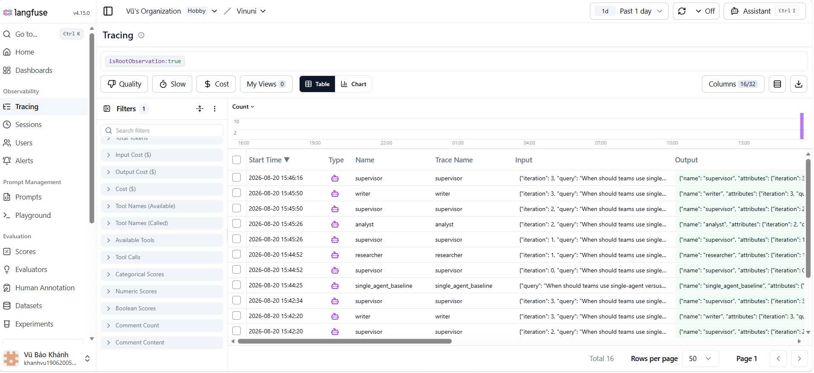

# Benchmark Report

| Run | Latency (s) | Cost (USD) | Quality | Citation cov. | Failure rate | Notes |
|---|---:|---:|---:|---:|---:|---|
| single-agent | 26.73 | 0.0000 | 10.0 |  | 0% | tokens=1159; routes=0 |
| multi-agent | 86.26 | 0.0000 | 10.0 | 100% | 0% | tokens=6146; routes=4 |

## Methodology

Both systems use the same Gemini model and query. Latency is end-to-end wall-clock time. Token totals come from provider usage metadata. Cost is USD 0 for the configured Gemini free tier. Citation coverage is the fraction of retrieved source IDs cited in the final answer; it is not applicable when a run retrieves no sources.

Quality is a reproducible 0–10 proxy: non-empty answer, at least 100 words, and explicit Findings, Limitations, and Conclusion sections are each worth two points. A peer reviewer should replace this proxy with the course rubric score for final submission.

## Failure mode and mitigation

A weak or unsupported Researcher note can cascade through Analyst and Writer. The system mitigates this by preserving source IDs and synthetic labels in shared state, requiring citations at every handoff, bounding iterations, validating routes, applying provider timeouts/retries, and exposing each agent span in Langfuse for audit.

## Trace evidence

The Langfuse trace captured on 2026-08-20 shows the single-agent baseline and the complete
multi-agent route: Supervisor → Researcher → Supervisor → Analyst → Supervisor → Writer →
Supervisor. Inputs and outputs remain inspectable for each role.

